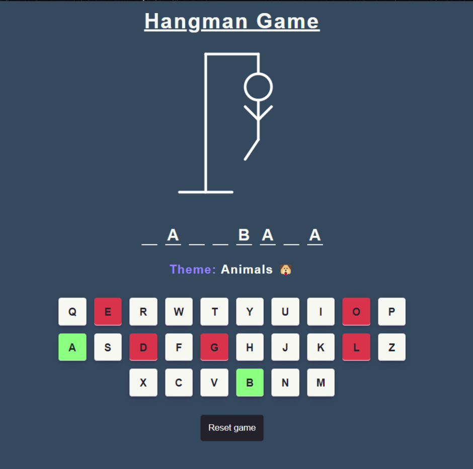

<h1 align="center">
    Hangman Game 🪑
</h1>

<div align="center">
   <a href="https://github.com/JohnPetros">
      
   </a>
   
   <a href="https://github.com/JohnPetros/hangman-game/commits/main">
      
   </a>
  </a>
   </a>
   <a href="https://github.com/JohnPetros/hangman-game/blob/main/LICENSE.md">
      
   </a>
    
</div>

<br>

## 🖥️ About the App

This app is a **Hangman game** in which the user have to guess a word before a man be hanged. This app was developed to practice the basics of TypeScript.

### ⏹️ Demonstration

<div align="center">
   
</div>

---

## ✨ Features

[x] Set random word by theme
[x] Shows each member of the man as the user guesses a wrong letter in the word
[x] Show final message at the end of the game informing whether the user has won or not
[x] Show visual feedback on keyboard
[x] Allow the user to restart the game whenever he wants
[x] Listen to both click and key press events

---

## 🛠️ Technologies

This app was developed using the following technologies:

✔️ **[ReactJs](https://react.dev/)**

✔️ **[TypeScript](https://www.typescriptlang.org/)**

---

## 🚀 How to run this app?

### Prerequisites

You will need a package manager like [npm](https://www.npmjs.com/) or [yarn](https://yarnpkg.com/) to run the application.

#### 📟 Running the application

```bash

# Clone this repo
$ git clone https://github.com/JohnPetros/hangman-game.git

# Access the app's folder
$ cd hangman-game

# Install the dependecies
$ npm install or yarn add

# Run the app in development mode
$ npm run dev or yarn dev

# The app will probably runnig on http://localhost:5173

```

---

## ⚙️ Deploy

This app was deployed by **[Vercel](https://vercel.com/home)**. This means you can access the running app by accessing this **[link](https://hangman-game-murex.vercel.app/)**.

---

## 💪 How to contribute

```bash

# Fork this repo
$ git clone https://github.com/JohnPetros/hangman-game.git

# Create a branch with your feature;
$ git checkout -b my-feature;

# Commit your changes:
$ git commit -m 'feat: My new feature';

# Push to your branch:
$ git push origin my-feature

```

> You also can open a [new issue report](https://github.com/JohnPetros/hangman-game/issues). It will be an honor to be able to help you and improve this application as well.

---

## 📝 License

This app is under MIT lincese. See the [License file](LICENSE) for more details.

---

<p align="center">
   Made with 💜 by John Petros 👋🏻
</p>
